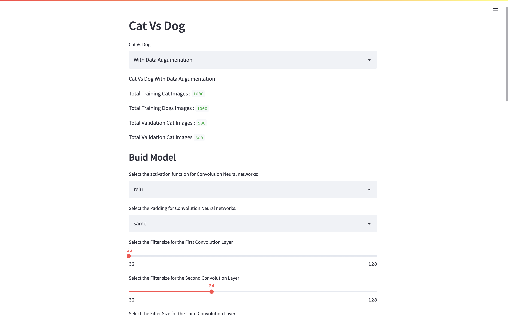
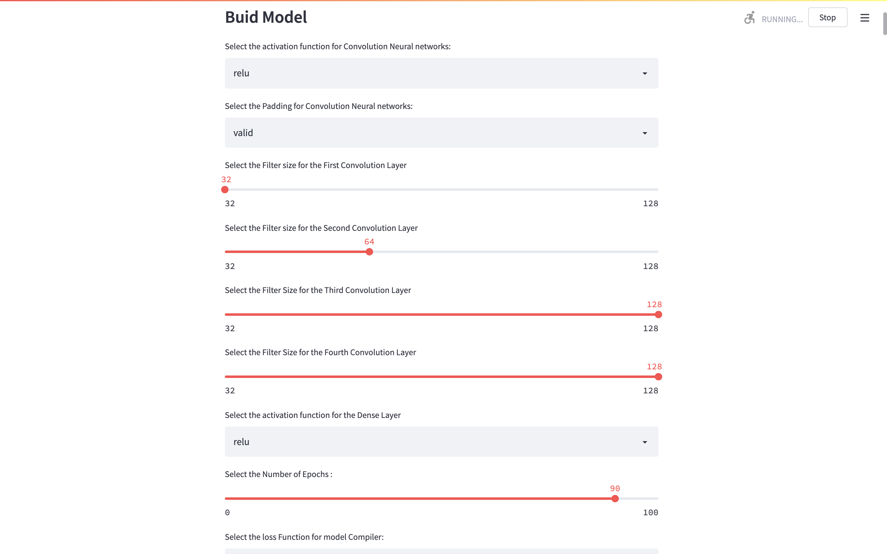
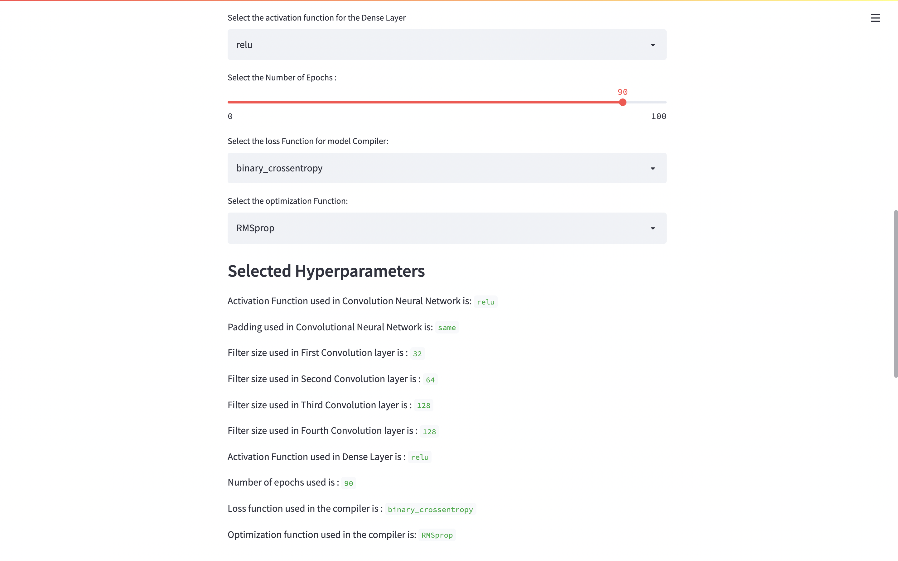
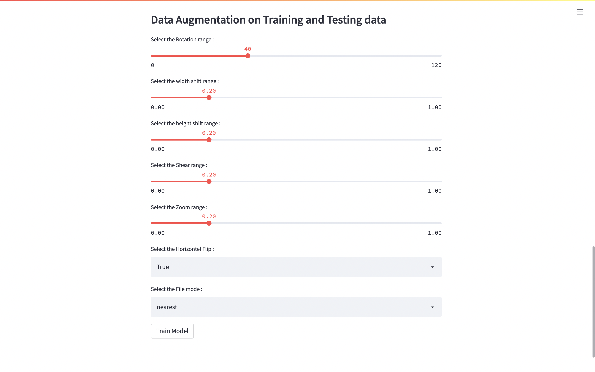
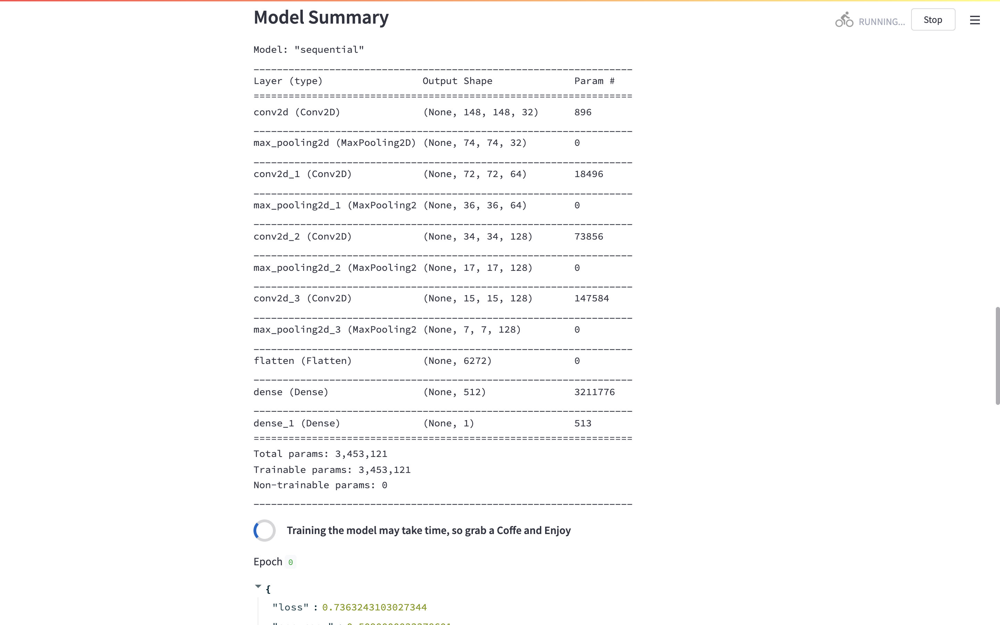
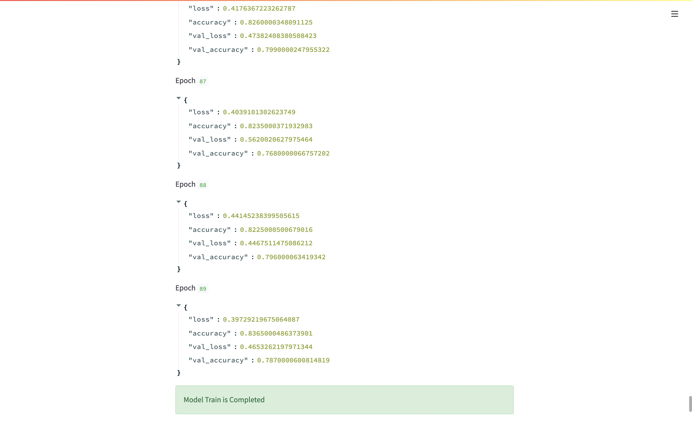
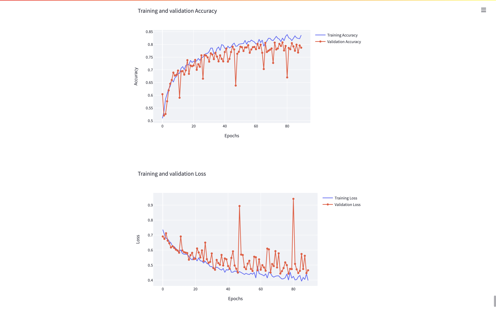

# Cat-Vs-Dog-with-Data-Augmentation

This Repository help user to understand Data Augmentation Concept on Cat and Dog dataset which is small dataset. 

**Data Aumentation** is data analysis techniques used to increase the amount of data by adding slight midified copies of already existing data. 

Data Augmentation act as a regularizer and help to reduce overfitting when training a Machine Learning model.

Data Augmentation is helpful if you have small data.

# Streamlit Online Application 

Where you can `upload the image` to check whether it Cat or Dog using pre-trained model.

[Streamlit Appilaction](https://share.streamlit.io/arpitkamal/cat-vs-dog-with-data-augmentation/main/app.py)

# How to Install Dependencies to Run the application.

The following bash code will install all the necessary dependencies.

```bash
git clone https://github.com/Arpitkamal/Cat-Vs-Dog-with-Data-Augmentation.git
cd Cat-Vs-Dog-with-Data-Augmentation
pip install -r requirements.txt
```

# how to run in local machine 

To run the application go the downloaded Directory and run this command

```bash
streamlit run main.py
```

To run the application where you can test the `pre-trained model` by uploading a image.

```bash
streamlit run application.py
```

# Stremlit Application

In this Application user can Train the Convolutional Neural Network with or without Data Augmentation.



### User can Build the Model by Selecting the Hyperparameter

By Selecting following Hyerparameter:

`Activation function` for the convolution Neural Network.<br />
`Padding` for the Convolutional Neural Network.<br />
`Filter size` for the First Convolution Layer.<br />
`Filter size` for the Second Convolution Layer.<br />
`Filter size` for the Third Convolution Layer.<br />
`Filter size` for the Fourth Convolution Layer.<br />
`Activation function` for the Dense Layer.<br />
`Number of Epochs` you want to Run the Model.<br />
`loss Function` for model Compiler.<br />
`optimization Function` for the model Compiler.<br />




### User can select Different Parameters for Data Augmentaion 

By selecting following Parameters:

`Rotation range` is a value in degrees (0–180), a range within which to randomly rotate pictures.<br />
`width shift range` and `height shift range` are ranges (as a fraction of total width or height) within which to randomly translate pictures vertically or horizontally.<br />
`Shear range` is for randomly applying shearing transformations.<br />
`Zoom range` is for randomly zooming inside pictures.<br />
`Horizontel Flip` is for randomly flipping half of the images horizontally. This is relevant when there are no assumptions of horizontal assymmetry (e.g. real-world pictures).<br />
`File mode` is the strategy used for filling in newly created pixels, which can appear after a rotation or a width/height shift.<br />

Once user selected all the above parameters. 
User can click the `Train Model` button to train the model.



After clicking Button application show the Model Summary and start training the model.




In the end Application will Display two plot:  

1. Training and Validation Accuracy
2. Training and Validation Loss




# Other option

If you don't want to run Streamlit application just clone the repository and run `testing.ipynb` file to see the work of Data augmentation. 


